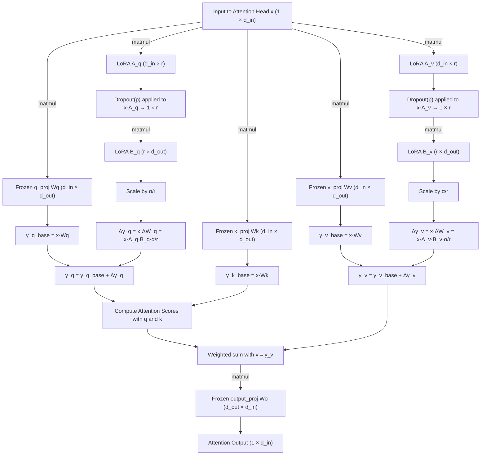

```mermaid
flowchart TB
    %% Input to attention
    X["Input to Attention Head x (1 × d_in)"]

    %% Frozen weights
    Wq["Frozen q_proj Wq (d_in × d_out)"]
    Wv["Frozen v_proj Wv (d_in × d_out)"]
    Wk["Frozen k_proj Wk (d_in × d_out)"]
    Wo["Frozen output_proj Wo (d_out × d_in)"]

    %% Base projections
    X -->|matmul| Wq --> Yq_base["y_q_base = x·Wq"]
    X -->|matmul| Wv --> Yv_base["y_v_base = x·Wv"]
    X -->|matmul| Wk --> Yk_base["y_k_base = x·Wk"]

    %% LoRA adapters for q_proj
    X -->|matmul| Aq["LoRA A_q (d_in × r)"]
    Aq --> Dq["Dropout(p) applied to x·A_q → 1 × r"]
    Dq -->|matmul| Bq["LoRA B_q (r × d_out)"]
    Bq --> Scaleq["Scale by α/r"]
    Scaleq --> Yq_lora["Δy_q = x·ΔW_q = x·A_q·B_q·α/r"]

    %% LoRA adapters for v_proj
    X -->|matmul| Av["LoRA A_v (d_in × r)"]
    Av --> Dv["Dropout(p) applied to x·A_v → 1 × r"]
    Dv -->|matmul| Bv["LoRA B_v (r × d_out)"]
    Bv --> Scalev["Scale by α/r"]
    Scalev --> Yv_lora["Δy_v = x·ΔW_v = x·A_v·B_v·α/r"]

    %% Combine base + LoRA
    Yq_base --> SUMq["y_q = y_q_base + Δy_q"]
    Yq_lora --> SUMq
    Yv_base --> SUMv["y_v = y_v_base + Δy_v"]
    Yv_lora --> SUMv

    %% Attention computation (simplified)
    SUMq --> Softmax["Compute Attention Scores with q and k"]
    Yk_base --> Softmax
    Softmax --> WeightedSum["Weighted sum with v = y_v"]
    SUMv --> WeightedSum

    %% Output projection
    WeightedSum -->|matmul| Wo --> Y_final["Attention Output (1 × d_in)"]

```

