# QuantaHR 🚀

**Your Private, Lightweight HR AI Assistant**  

QuantaHR is a smart, resource-efficient HR assistant powered by a **special-purpose QLoRA LLM** trained on your own data. Say goodbye to expensive, heavy general-purpose LLMs — now you can run a **private, high-performance HR assistant** with minimal CPU, memory, and storage requirements.  

---

## 🌟 Key Benefits

- **Private & Secure**  
  Keep all your HR data on-premise or in your private cloud. Your sensitive information never leaves your infrastructure.  

- **Custom-Tailored Knowledge**  
  Build your own QLoRA LLM on your company-specific HR policies, documents, and FAQs. QuantaHR understands your organization like no generic model can.  

- **Resource-Efficient**  
  Unlike massive general-purpose LLMs that require high CPU, memory, and storage, QuantaHR is **optimized for minimal resources** — making it feasible to run on standard servers or even powerful desktop machines.  

- **Fast & Responsive**  
  Smaller model size + optimized quantization means faster inference times and near-instant responses for your HR queries.  

- **Easy to Deploy & Scale**  
  Deploy QuantaHR on your local machine, private server, or containerized environment. Scale according to your team’s needs without breaking the bank.  

---

## 💡 Use Cases

- Automate answers to HR FAQs  
- Summarize policies and documents for employees  
- Generate personalized onboarding instructions  
- Assist HR teams with recruitment and employee management tasks  

---

## ⚙️ How It Works

1. **Data Preparation**: Collect your HR documents, policies, and FAQs.  
2. **Build a Special-Purpose QLoRA LLM**: Train a quantized LLM on your own data.  
3. **Deploy & Run**: Run your private LLM locally or on a lightweight server.  
4. **Interact**: Ask QuantaHR questions and get intelligent, context-aware answers instantly.  

---

## 📈 Why QuantaHR?

Running large general-purpose LLMs is **expensive and resource-heavy**. QuantaHR leverages **QLoRA quantization** to deliver:  

- Drastically reduced memory footprint  
- Faster CPU inference  
- Lower storage requirements  
- A model trained **specifically for your HR domain**  

All this without compromising on accuracy or intelligence.  

---

## Pre-requisites

### 1. AWS CLI Pre-setup
   - Ensure that you have an `AWS Account` and valid `AWS credentials` (i.e., a pair of **aws_access_key_id** <-> **aws_secret_access_key**).
   - Ensure that your AWS account has sufficient admin privileges to execute the Infrastructure as a Code setup at `iac/terraform/main.tf`
   - Install `AWS CLI` in your local machine (please see `https://docs.aws.amazon.com/cli/latest/userguide/getting-started-install.html`)
   - Configure your AWS credentials to your default AWS profile using `aws configure` command inside the `$HOME/.aws` folder.

### 2. Install `Podman Desktop` from `https://podman-desktop.io/docs/installation` and make sure that there is a default podman machine running with admin privileges.

**Below are some example scenarios**
##### Scenario 1

Check whether a podman machine is automatically spawned after `Podman Desktop` with admin previleges
**OR**
Whether you already have an existing podman machine with admin previleges
```bash
podman machine ls                    
# NAME                    VM TYPE     CREATED      LAST UP            CPUS        MEMORY      DISK SIZE
# podman-machine-default  applehv     3 weeks ago  Currently running  4           4GiB        20GiB

podman machine inspect podman-machine-default  | grep Rootful
#           "Rootful": true,
```

##### Scenario 2
Creating a brand new podman machine with admin previleges
```bash
podman machine init --rootful
podman machine start
```

##### Scenario 3
Updating an existing podman machine with admin previleges.
```bash
podman machine stop
podman machine set --rootful=true
podman machine start
```

---

## How to run

1. In a `terminal` (i.e., `command prompt`) using `cd`, **navigate to the directory where this README.md is located**.
2. Run `podman` from `terminal` as below. You could check for more options by reading through comments in `docker-compose.yml`

```bash
podman compose up --build
```

---

## Declarative Quantization Configuration

##### data/config/qlora_config.json

```json
{
  "model": {
    "name": "QLoRA-HR-Assistant-Float-16",
    "base_llm_model": "TinyLlama/TinyLlama-1.1B-intermediate-step-1431k-3T",
    "quantization": {
      "load_in_4bit": true,
      "bnb_4bit_compute_dtype": "float16",
      "bnb_4bit_use_double_quant": true,
      "bnb_4bit_quant_type": "nf4"
    },
    "lora": {
      "r": 16,
      "lora_alpha": 32,
      "target_modules": ["q_proj", "v_proj"],
      "lora_dropout": 0.05,
      "bias": "none",
      "task_type": "CAUSAL_LM"
    },
    "max_sequence_length": 1024
  },
  "dataset": {
    "type": "json",
    "train_files": "data/llm/train/*.json",
    "validation_files": "data/llm/validate/*.json"
  },
  "training": {
    "per_device_train_batch_size": 4,
    "gradient_accumulation_steps": 4,
    "warmup_steps": 50,
    "max_steps": 1000,
    "learning_rate": 0.0002,
    "fp16": true,
    "logging_steps": 10,
    "save_strategy": "steps",
    "save_steps": 50,
    "save_total_limit": 5,
    "report_to": "none",
    "resume_from_uploads": true
  },
  "prompt_format": {
    "include_input": true
  },
  "compute": {
    "platform": "aws",
    "instance_type": "g5.xlarge",
    "boot_os_query": "Deep Learning AMI GPU PyTorch*Ubuntu 20.04*"
  }
}
```

---

## How QLoRA Works (for the above JSON example)

```mermaid
flowchart TB
    %% Input to attention
    X["Input to Attention Head x (1 × d_in)"]

    %% Frozen weights
    Wq["Frozen q_proj Wq (d_in × d_out)"]
    Wv["Frozen v_proj Wv (d_in × d_out)"]
    Wk["Frozen k_proj Wk (d_in × d_out)"]
    Wo["Frozen output_proj Wo (d_out × d_in)"]

    %% Base projections
    X -->|matmul| Wq --> Yq_base["y_q_base = x·Wq"]
    X -->|matmul| Wv --> Yv_base["y_v_base = x·Wv"]
    X -->|matmul| Wk --> Yk_base["y_k_base = x·Wk"]

    %% LoRA adapters for q_proj
    X -->|matmul| Aq["LoRA A_q (d_in × r)"]
    Aq --> Dq["Dropout(p) applied to x·A_q → 1 × r"]
    Dq -->|matmul| Bq["LoRA B_q (r × d_out)"]
    Bq --> Scaleq["Scale by α/r"]
    Scaleq --> Yq_lora["Δy_q = x·ΔW_q = x·A_q·B_q·α/r"]

    %% LoRA adapters for v_proj
    X -->|matmul| Av["LoRA A_v (d_in × r)"]
    Av --> Dv["Dropout(p) applied to x·A_v → 1 × r"]
    Dv -->|matmul| Bv["LoRA B_v (r × d_out)"]
    Bv --> Scalev["Scale by α/r"]
    Scalev --> Yv_lora["Δy_v = x·ΔW_v = x·A_v·B_v·α/r"]

    %% Combine base + LoRA
    Yq_base --> SUMq["y_q = y_q_base + Δy_q"]
    Yq_lora --> SUMq
    Yv_base --> SUMv["y_v = y_v_base + Δy_v"]
    Yv_lora --> SUMv

    %% Attention computation (simplified)
    SUMq --> Softmax["Compute Attention Scores with q and k"]
    Yk_base --> Softmax
    Softmax --> WeightedSum["Weighted sum with v = y_v"]
    SUMv --> WeightedSum

    %% Output projection
    WeightedSum -->|matmul| Wo --> Y_final["Attention Output (1 × d_in)"]

```




